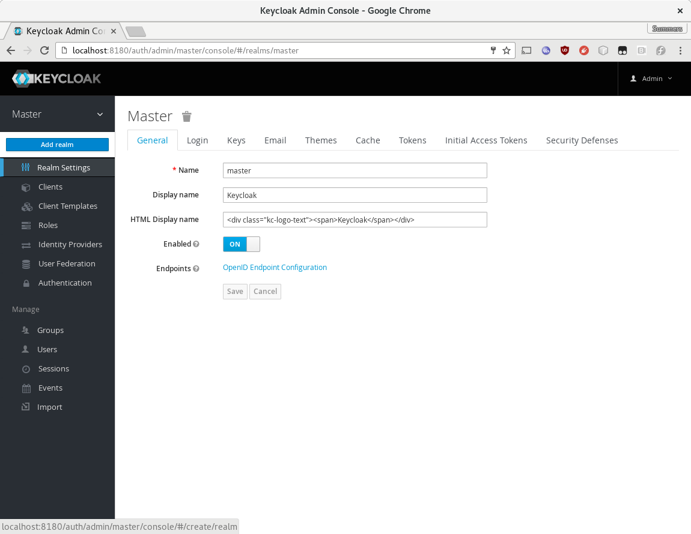
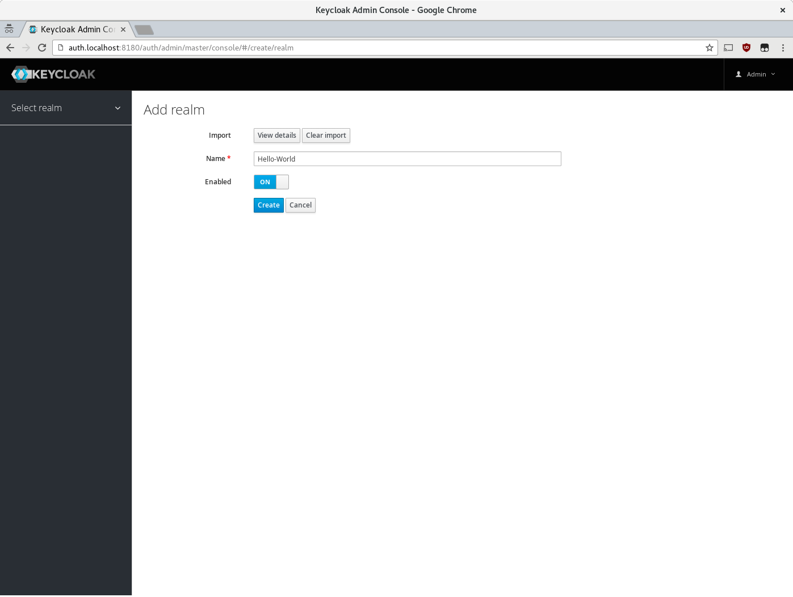
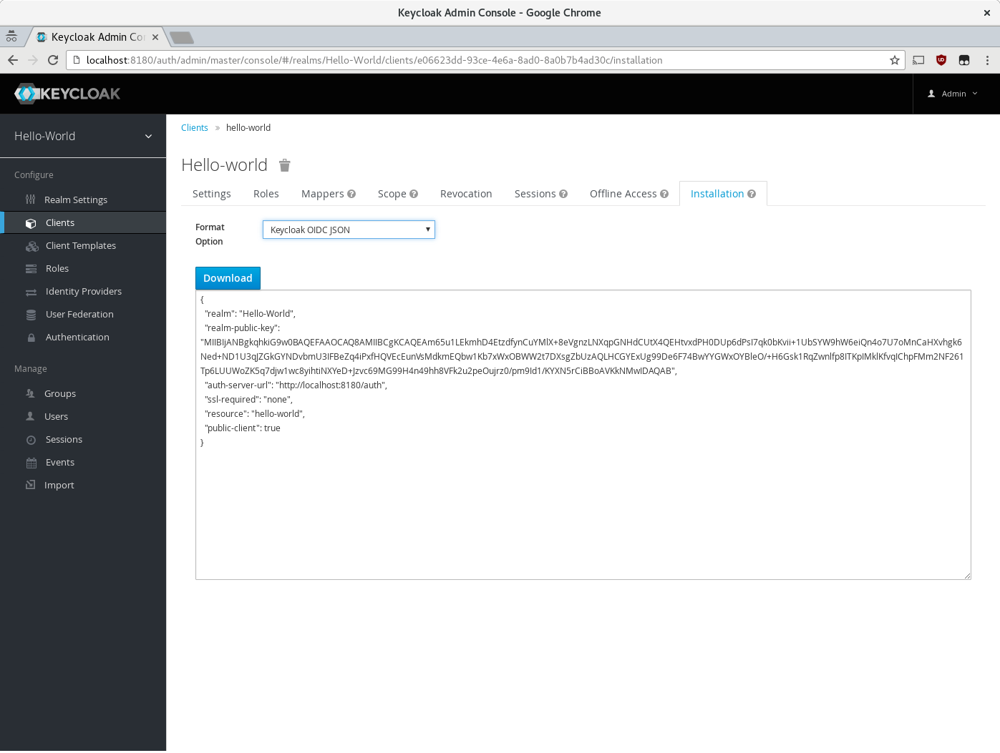
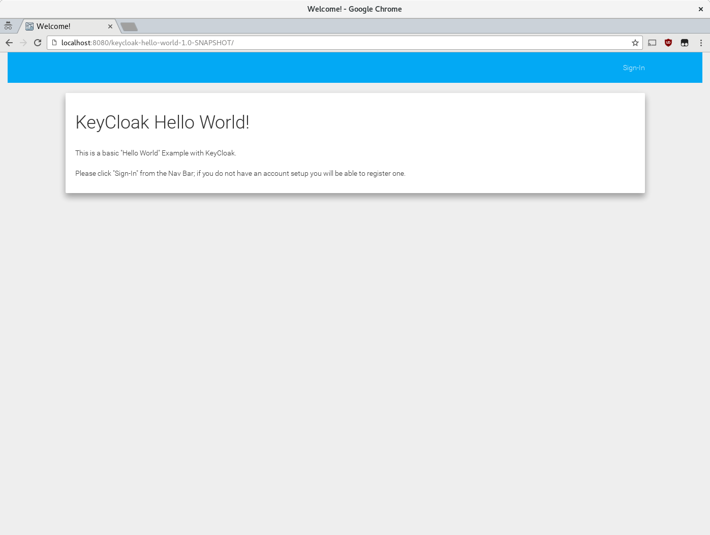
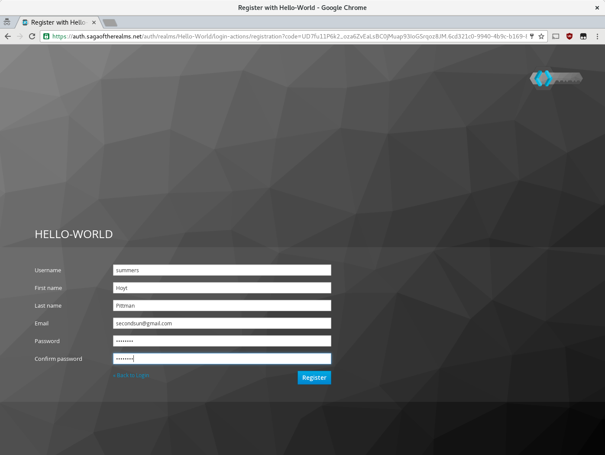
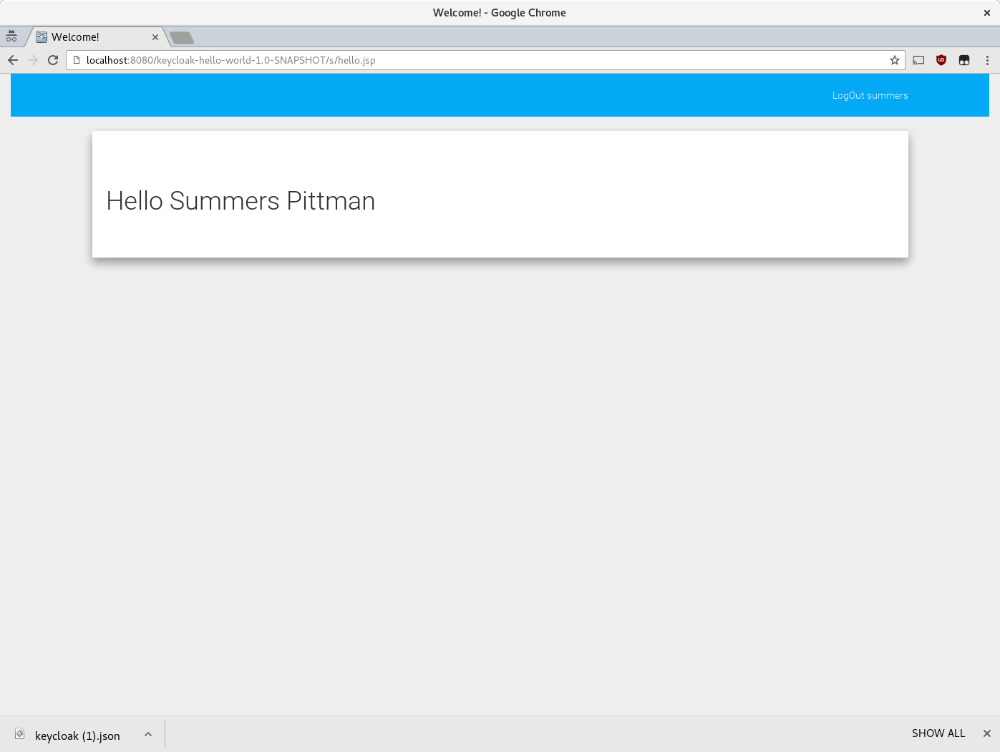

# Keycloak Hello-World

This is a VERY basic project that demonstrates how to use [Keycloak](http://keycloak.org) to provide authentication to an application. 

The Keycloak server is a web application which provides authentication and authorization services to applications.  The Keycloak project also supplies adapters which abstract the details of this process from the developer and only expose what is absolutely necessary.  This demonstration uses Keycloak to provide authentication to a Hello World application running on WildFly.  

This README will walk you through running the project up using [Docker](https://www.docker.com/products/docker).  

# Prerequisite Software
 * [Docker](https://www.docker.com/products/docker)
 * [Java JDK 8](http://www.oracle.com/technetwork/java/javase/downloads/jdk8-downloads-2133151.html)
 * [Maven](maven.apache.org/download.cgi)

# Keycloak Server Setup

We will be using Keycloak's [Docker container](https://hub.docker.com/r/jboss/keycloak/).  
```bash 
# Run the Keycloak Container
docker run -h auth.localhost -p 8180:8080 -e KEYCLOAK_USER=admin -e KEYCLOAK_PASSWORD=admin --name hello-world-keycloak jboss/keycloak:2.0.0.Final
```

If everything ran correctly, we should be able to navigate to [http://auth.localhost:8180/auth](http://auth.localhost:8180/auth)

# Load the Hello-World Realm

Log into the [Keycloak Administration Console](http://auth.localhost:8180/auth/admin/) using the username "admin" and the password "admin".

You will want to add the "Hello-World" Realm.  You can do this by selecting "Add Realm" from the drop down that appears when you mouse over "Master".



Choose "Select File" and load the [realm.json](realm.json) file in the root of this project.  The "Name" field should populate with "Hello-world".



Now click "Create".  Your realm is setup and we can continue to setting up the application.

# Compile Keycloak-Hello-World

Before we can compile the application, we need to load the "keycloak.json" file from the Keycloak Administration Console.  You can either follow [this link](http://auth.localhost:8180/auth/admin/master/console/#/realms/Hello-World/clients/e06623dd-93ce-4e6a-8ad0-8a0b7b4ad30c/installation) or navigate to the "Clients" section of the "Hello-World" realm in the Keycloak Administration Console, select "hello-world", and then navigate to the "Installation" tab.  Either way, form the Intallation tab you will want to select the "Keycloak OIDC JSON" option from the "Format Options" menu and then click "Download" and save the keycloak.json file to the [WEB-INF](src/main/webapp/WEB-INF) directory.



To compile the application we need to invoke maven from the command line.

```bash
mvn clean install
```

# Start the Wildfly Server

We will again use Docker to launch the Wildfly server.  Wildfly is a Java EE server which will run our application.

First we need to build the container from the [docker](docker) directory.

```bash
docker build --tag keycloak-hello-world .
```

You should see the message "Successfully built" if docker is build successfully.

Now we need to start the Docker container

```bash
docker run --net=host -d -p 8080:8080 -p 9990:9990 --name hello-world keycloak-hello-world
```

Once the Docker container has started, we should be able to navigate to [http://localhost:8080].

# Run the Application

Finally, from the root of this project we will deploy the application to WildFly.

```
mvn  wildfly:deploy -Dwildfly.username=admin -Dwildfly.password=admin
```

Once the deployment has finished, we can navigate to [http://localhost:8080/keycloak-hello-world-1.0-SNAPSHOT/](http://localhost:8080/keycloak-hello-world-1.0-SNAPSHOT/).

Click "Sign-in", 



"Register" a user, 



And voilà!



# Implementation Details
The application in the [web.xml](src/main/webapps/WEB-INF/web.xml) file declares that the path /s/hello.jsp is restricted to only logged in sessions with the "user" role.  

The "user" role is defined in the realm.json file and is set to be a default role for the realm.  When a user browses to "/s/hello.jsp" the Keycloak adapter intercepts this request, prompts for a log-in if necessary, and then provides to the application the user's details.

The [hello.jsp](src/main/webapp/s/hello.jsp) file displays the user's Name.  This is injected into the request by the Keycloak adapter which is has been configured to be loaded by WildFly.

# Closing Notes

We used Docker to speed up the process a lot.  Namely we skipped configuring the Wildfly Client Adapter that the Hello World application uses to broker sessions between the application and the auth server.  The official [Keycloak docs](https://keycloak.gitbooks.io/getting-started-tutorials/content/v/2.0/topics/secure-jboss-app.html) have much more detailed steps for the process.

Also, as a point of note, when we started out application using Docker we users "--net=host".  This is GENERALLY bad practice and I only used it to make the demonstration easier.  In an ideal world we would link the containers, or configure DNS properly to route between them.